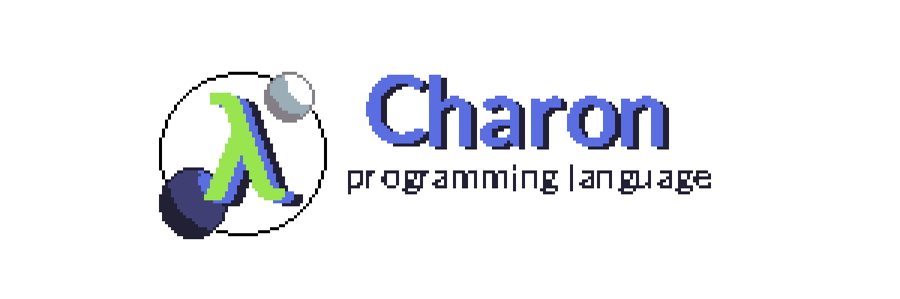

<p align="center">
  <a aria-label="License badge" href="LICENSE">
    
  </a>
  <a aria-label="Issues Badge" href="https://github.com/sigmasoldi3r/charon-lang/issues">
    
  </a>
  <a aria-label="Release Badge" href="https://github.com/sigmasoldi3r/charon-lang/releases">
    
  </a>
  <a aria-label="Discord Badge" href="https://discord.gg/GuRqctF">
    
  </a>
</p>

# Charon Programming Language

Charon is a simple dynamic typed, functional programming language.

The aim of charon is to provide a LISP like syntax, and a functional way
of defining programs. Charon enforces the programmer to distinguish between
the pure functions and the impure ones.

```clj
; Hello world
(println! "Hello World!")
```

You can find the documentation on [Github Pages](https://sigmasoldi3r.github.io/charon-lang).

## Binaries

At the moment only windows is built, in the future binary distributions for
other OSes will be added.

Beware that the compiler and language spec is in alpha stage.

Go to releases https://github.com/sigmasoldi3r/charon-lang/releases to grab
the latest.

## Usage notes

If you want the runtime to be shared (Smaller script sizes!), you can extract it
locally by running `charon --extract-runtime`.

Otherwise you can just compile normally and provide `--embed-runtime` for every
file.

## Contributing

If you want to support this project, you can become a backer,
sponsor or a contributor. Any of those, will be very helpful,
even if your unique contribution is fix a typo in the readme!

[](https://github.com/sponsors/sigmasoldi3r)

Or you can also contribute to the project!

[](https://github.com/sigmasoldi3r/charon-lang/issues)

**Made a project with Charon?**

You can place the Charon's badge in your readme to help spread
the word!

[![Charon Badge](https://img.shields.io/badge/made_with-Charon-3f3f74?style=for-the-badge&link=https://github.com/sigmasoldi3r/charon-lang&logoWidth=25&logo=data:image/png;base64,iVBORw0KGgoAAAANSUhEUgAAACAAAAAgCAYAAABzenr0AAAAAXNSR0IArs4c6QAAAlxJREFUWIXtlr9rk0Ecxj8n/Rekg5GGkEF0aIcsRQhOggglkM3NSRxKx1gsAUsgdFSnoHQoqIO8ol3qGITSpcP7urRTaZpmCF066XgOfe96b967vPe+BETwgUDeu+/d89zz/d4P+I+/DJEzXmbN12l3bXFiY3M9J1WaOIscQHbaXfku2JMmOu2ujIWlcMOTWODhVqfdZX5xCYD3X77r9pevXqi5UpjLINekvVEjMcHF8ZI4+vaUD28WNPk0KBEbm+uJhbgcSJDbcPNOKAFZKddkpVyzxpguuGAT4CIXl2fVRHu9tcbySgAgt3cCAMZRmEvEtBQk8OzWVwB6o4bAnk/dNo5CXQtKxDgKmbQf0g5kWq+EmIhdYHsn0GPHUZj4xfOmhJsCMskN6Lh6a83WJya/XeeAdwo8YVa5tY6YWGjWOeANlQbXjnBBCfC2vzdqqHgNSxpyC5glMu8LM6aIACdBkTTkEhDbr/Fj67X+XzQNM0+BOhl9XUhtw3hgyubWfimRO7X6rfvntPZLwJULpit5BAhA3rv7SPz+dSFvLzzQAaXF1ZioKRWRJ1w7y30OTJKbMMnVKg92m9bYPMU4Zwa6yDOgViPhuhjrrRKfnz9meSXQbwYsrmQW4Xn01lrh5uptFxTAfPmhPNhtTj0XVA1IgOGgb3Xh45MqcF0PJk5OD5UI0Rs1uDyr8vPTquu6TtWEAKiUa3pAVhqGgz4np4d5X9NOAakUDAf9AnMXIzcFJDpnKMJ8VVvhLEKbiLjN136v57zudJ2AcFUXce49uZNzewdNEwGInAL+DfwBXCfqVaSscnUAAAAASUVORK5CYII=)](https://github.com/sigmasoldi3r/charon-lang)

You have the code for the badge [at the bottom of the document](#badges).

## The Language

### Function purity

Charon functions must be pure by default. That is true if they follow a simple
rule: Do not invoke impure functions. That's it.

Note that any I/O is considered impure.

The advantage\* of pure functions is that they can be memoized and even constant
expressions (compile time inlined). Plus test-friendly, as they are idempotent.

\*Note: Not currently implemented.

**Disclaimer:** As Charon is a language designed to target and interface with
Lua, the purity check is somewhat loose, and can be tricked. For example calling
by reference a function who's symbol is not a function but a local might lead to
unchecked execution of mixed contexts. For that reason anything that might be
unchecked is considered impure. This is also a pending work for Charon, to
include purity checks for locals and referential calls.

Also this means that object manipulation (either read or write) is always
impure, and for that same reason you can't mutate tables or lists.

Examples:
```clj
; This is pure
(defn sum [a b]
  (+ a b))

; This is impure
(defn! shout []
  (println! "Hello!"))

; This is legal
(defn! something []
  (println! "2 + 2 =" (sum 2 2)))

; This is illegal
(defn some-other []
  (shout))
```

Pure functions can be called from impure context, but not the other way round.

### Dealing with the state

Charon does not have any operator for mutating state. Instead, provides the term
of an atom, which in turn contains read and write operations which are impure.

Atoms are implemented outside of the language, as charon does not have any way
of "assigning" a variable as other languages do.

## Standard library

Data structures are immutable in Charon, besides the `object` type, for
interoperability reasons.

This means that Charon provides no means to alter an already created `list`,
`table`, `symbol` or string. Also those structures are frozen by default in
order to prevent escaping the immutability.

You could have:

```clj
(declare myLuaFunc)
(def my-list [1 2 3])
; my-list should remain [1 2 3] FOREVER, def is also constant.
(myLuaFunc my-list)
```

And in Lua, you could try to escape this:

```lua
function myLuaFunc(charonList)
  charonList[4] = 27;
  -- I did-it!
end
```

As said before, to prevent this from happening the program will throw an error
upon modification of any fields of the data structure.

Module system is described in [docs/Module System](docs.md#module-system).

Charon standard library is small, it relies on Lua standard library for most
things.

**WARNING**: All standard library functions should be tested (Not tested yet).

Note: All functions, methods and operators are being documented at
[docs.md](docs.md), but still being written. This document is a simple
introduction to the language and it's features.

### String interpolation\*

\*Note: Not currently implemented.

Typically, to concatenate strings you would do:

```clj
(def world "World!")
(def mystr
  (str "Hello, " world))
(def my-result
  (str "2 + 2 is " (+ 2 2)))
```

Which works OK, but sometimes can be less readable and tedious. Instead you can
just use the string interpolation token and place any s-expression or name:

```clj
(println! "Hello, $world")

(println! "You can do 2 + 2 = $(+ 2 2)")
; Prints "You can do 2 + 2 = 4"

; Want to escape?
(def mystr "Be like \$(+ 2 2) = $(+ 2 2)")
(println! mystr)
; Prints "Be like $(+ 2 2) = 4"
```

### List

A list is a collection of values. List is immutable, but you can join and
append to create new ones.

To create a new list use the literal `[]`.

- `list/merge` merges two lists into a new one.
- `list/append` appends elements to the list.
- `list/prepend` prepends elements to the list.
- `list/get` returns the nth element or `unit`.
- `list/len` returns the length of the list.
- `list/drop` returns a new list dropping n elements from the right.
- `list/drop-left` returns a new list dropping n elements from the left.
- `list/map` returns a new list with the result of the mapping function for each element.
- `list/filter` returns a new list filtered using the result of the filter function.
- `list/each` calls the function for each element, presumably for side effects. Returns `unit`.

```clj
; Example
(def my-list [1 2 3 4])
```

### Table

A table is a collection of arbitrarily keyed objects. This means that a table's
key can be anything, even `unit`!

To create a new table use the literal `{}`.

```clj
; Example
(def my-table
  { :hello "World"
    :use "symbols for keys, usually."
    55 "But you can really use anything"
  })
```

### Object

An object is anything that is not a primitive, or a standard collection. The
underlying implementation is a any Lua table, and is the primary method for
interacting with existing Lua codebase.

Do not confuse a Lua table with a Charon table, they represent different logical
collections.

Example:
```lua
-- Suppose you have existing old code
local my_object = {
  name = "Object"
};
function my_object:something()
  print("I am " .. self.name);
end
function my_object.static()
  print("I am another method");
end
```

The easiest and the static (Fast in runtime) way of generating POLTs is:
```clj
'{:this "way"}

; Eg: Like doing local some_loc = {plain = "object};
(def some-loc '{:plain "object"})
```

The literal is just like the table literal but with a single quote `'{}` at the
start.

To interface it with Lua, you can import the object (Or declare extern if
global):
```clj
(import [ my_object ] :from "my_script.lua")

(println!
  (object/get my_object "name"))

(object/set my_object "new_field"
  (fn [self]
    (println! "I am a method!")))

; There's also a shorthand for calling methods
(my_object:something)
(my_object::static)

; Creates a new Lua table, keys are not symbols but strings (Plain old Lua).
(def my_second_object
  (object/new
    { :some_field "Hey"
      :some_other 539
    }))
```

At the moment, there are three object interaction methods:

- `object/new` the only pure function, creates a new object from a table.
  Deep translates symbols like `:some_key` to string. If for some reason you
  want to build an object untouched use `object/new-raw`.
- `object/new-raw` same as `object/new` but leaves keys as is.
- `object/set` sets the field to a value, thus impure.
- `object/get` gets the field, and as objects are mutable this is also impure.

### Meta

To get the type of value you can use the `type` function:

```clj
; Examples
(assert
  (= (type [1 2 3]) :list))

(when (type val)
  :list "Yey a list"
  :table "Oh, the table."
  _ (throw (str "What is a " (type val) "?")))
```

Types returned are:
```clj
{
  :number  ; For primitive numbers, integers or not.
  :string  ; For primitive strings.
  :boolean ; For primitive booleans (true/false)
  :list    ; For Charon list collection.
  :table   ; For Charon table collection.
  :object  ; Any unknown object, from Lua context or by using (object/new ...)
  :unit    ; The null type
  :nothing ; For non-existing values like non-existing table entries
}
```

You can assert them or use in a when clause.

## Code Samples

To see code in action you can visit [samples/](samples/) folder.

#### Code samples

Name|File|Related
-|-|-
General example|[sample.crn](samples/sample.crn)|
Library example|[lib.crn](samples/lib.crn)|
wxLua example|[wxWidgets-demo.crn](samples/wxWidgets-demo.crn)|[wxLua](http://wxlua.sourceforge.net)

### Featured projects

This contains some example projects.

Name|Description|Related
-|-|-
[Pootis Explosion](https://github.com/sigmasoldi3r/charon-lang-gmod-addon-example)| A simple gmod addon to showcase the language|[Garry's Mod](https://store.steampowered.com/app/4000/Garrys_Mod/)
[TinyHTML](https://github.com/sigmasoldi3r/tinyhtml)|A simple HTML document generator|

Remember that functions are documented in [docs.md](docs.md) file.

Syntax is inspired by _Clojurescript_.
You can't define your own macros at the moment, but there are several included
with the compiler, like:

- `def` Which defines a package level **function**.
- `def-impure` Which defines a package level **impure function**.
- `def-value` Which defines a package level **constant**.
- `let` Binding, which works like clojure's let.
- `if` Block, the first expression is for true branch, the rest for false.
- `do` Block which simply runs the expression list and returns the last.
- `<-` Thread last and `->` thread first macros. This macro chains the
call expression list one inside another:
```clj
(-> 5 (a 1) (b 2)) ; becomes
(b (a 5 1) 2)
(<- 5 (a 1) (b 2)) ; becomes
(b 2 (a 1 5))
```
- Compose function `>>=` acts like threading macros but in fact is a function
that actually composes functions (Therefore return new functions). This is
considered **pure** despite that the produced function is impure.
```clj
(defn my-fn [a] (+ a 1))
(defn other [a] (* a 2))
(def third
  (>>= my-fn other))
; Equivalent:
(defn like-third [a]
  (* (+ a 1) 2))
```

Among others (To be documented).

More notes: import does not read any symbol from the module (Nor does export
the module any). This means that purity checks between library calls are faked
at the moment. The plan is to add symbols to Charon modules, and detect when
those are not charon modules in order to make purity check stricter.

# Badges

You can embed the Charon language badge on your website or readme.

Markdown:

```md
[![Charon Badge](https://img.shields.io/badge/made_with-Charon-3f3f74?style=for-the-badge&link=https://github.com/sigmasoldi3r/charon-lang&logoWidth=25&logo=data:image/png;base64,iVBORw0KGgoAAAANSUhEUgAAACAAAAAgCAYAAABzenr0AAAAAXNSR0IArs4c6QAAAlxJREFUWIXtlr9rk0Ecxj8n/Rekg5GGkEF0aIcsRQhOggglkM3NSRxKx1gsAUsgdFSnoHQoqIO8ol3qGITSpcP7urRTaZpmCF066XgOfe96b967vPe+BETwgUDeu+/d89zz/d4P+I+/DJEzXmbN12l3bXFiY3M9J1WaOIscQHbaXfku2JMmOu2ujIWlcMOTWODhVqfdZX5xCYD3X77r9pevXqi5UpjLINekvVEjMcHF8ZI4+vaUD28WNPk0KBEbm+uJhbgcSJDbcPNOKAFZKddkpVyzxpguuGAT4CIXl2fVRHu9tcbySgAgt3cCAMZRmEvEtBQk8OzWVwB6o4bAnk/dNo5CXQtKxDgKmbQf0g5kWq+EmIhdYHsn0GPHUZj4xfOmhJsCMskN6Lh6a83WJya/XeeAdwo8YVa5tY6YWGjWOeANlQbXjnBBCfC2vzdqqHgNSxpyC5glMu8LM6aIACdBkTTkEhDbr/Fj67X+XzQNM0+BOhl9XUhtw3hgyubWfimRO7X6rfvntPZLwJULpit5BAhA3rv7SPz+dSFvLzzQAaXF1ZioKRWRJ1w7y30OTJKbMMnVKg92m9bYPMU4Zwa6yDOgViPhuhjrrRKfnz9meSXQbwYsrmQW4Xn01lrh5uptFxTAfPmhPNhtTj0XVA1IgOGgb3Xh45MqcF0PJk5OD5UI0Rs1uDyr8vPTquu6TtWEAKiUa3pAVhqGgz4np4d5X9NOAakUDAf9AnMXIzcFJDpnKMJ8VVvhLEKbiLjN136v57zudJ2AcFUXce49uZNzewdNEwGInAL+DfwBXCfqVaSscnUAAAAASUVORK5CYII=)](https://github.com/sigmasoldi3r/charon-lang)
```

Or HTML:

```html
<a href="https://github.com/sigmasoldi3r/charon-lang">
  
</a>
```
